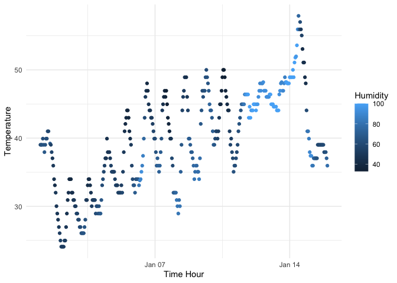

p8105_hw1
================
Qianying Wu
2023-09-20

## Problem 1

The dataset early_january_weather keeps track of the weather conditions
in early January.

``` r
data("early_january_weather")
head(early_january_weather)
```

    ## # A tibble: 6 × 15
    ##   origin  year month   day  hour  temp  dewp humid wind_dir wind_speed wind_gust
    ##   <chr>  <int> <int> <int> <int> <dbl> <dbl> <dbl>    <dbl>      <dbl>     <dbl>
    ## 1 EWR     2013     1     1     1  39.0  26.1  59.4      270      10.4         NA
    ## 2 EWR     2013     1     1     2  39.0  27.0  61.6      250       8.06        NA
    ## 3 EWR     2013     1     1     3  39.0  28.0  64.4      240      11.5         NA
    ## 4 EWR     2013     1     1     4  39.9  28.0  62.2      250      12.7         NA
    ## 5 EWR     2013     1     1     5  39.0  28.0  64.4      260      12.7         NA
    ## 6 EWR     2013     1     1     6  37.9  28.0  67.2      240      11.5         NA
    ## # ℹ 4 more variables: precip <dbl>, pressure <dbl>, visib <dbl>,
    ## #   time_hour <dttm>

``` r
nrow(early_january_weather)
```

    ## [1] 358

``` r
ncol(early_january_weather)
```

    ## [1] 15

``` r
# Mean Temp
mean(early_january_weather$temp, na.rm = TRUE)
```

    ## [1] 39.58212

### Variables:

There are 15 variables in the data. \* Origin: Contains a 3-letter
character. \* Year: integer variable representing year in the date. \*
Month: integer variable representing month in the date. \* Day: integer
variable representing day in the date. \* Hour: integer variable
representing hour in one day. \* Temp: Numeric variable with two decimal
points, representing the temperature. \* Dewp: Numeric variable with two
decimal points. \* Humid: Numeric variable with two decimal points. \*
Wind_dir: Numeric variable with some NAs. \* Wind_speed: Variable with
numeric values, representing speed of wind. \* Wind_gust: Variable with
numeric values and lots of NAs. \* Precip: Variable with numeric values.
Here all of them are 0.0. \* Pressure: Variable with numeric values and
some NAs. \* Visib: Variable with numeric values. \* Time-hour: Variable
with date and time.

### Size of the Data

There are 358 rows and 15 columns in the data.

### Mean Temperature

The mean temperature for early_january_weather is 39.58212.

### Scatterplot

``` r
scatterplot <- ggplot(data = early_january_weather, aes(x = time_hour, y = temp, color = humid)) +
  geom_point() + 
  labs(x = "Time Hour", y = "Temperature", color = "Humidity") +
  theme_minimal()

print(scatterplot)
```

<!-- -->

``` r
ggsave("scatterplot.png", scatterplot)
```

    ## Saving 7 x 5 in image

In this scatterplot, the x axis is time hour, y axis is the temperature,
and the data are separated by different levels of humidity in different
colors of blue. From the scatterplot, we can observe the overall trend
of temperature is increasing. Also, the temperature has small patterns
of rise and fall as the time_hour proceeds. From the graph, the maximum
temperature is around 58, which occurs slightly after time_hour of Jan
14. The minimum temperature is around 23, which is at the beginning of
January. We can also observe when time_hour before Jan 07, the humidity
tends to be low, and humidity becomes high in the time_hour of Jan 14.
After Jan 14, the temperature begins to drop and humidity becomes low
again.

## Problem 2

``` r
p2 <- tibble(num = rnorm(10),
             log_vec = num > 0,
             char = sample(letters, 10),
             factor = factor(sample(1:3, 10, replace = TRUE))
             )

mean(p2$num)
```

    ## [1] 0.226327

``` r
mean(p2$log_vec)
```

    ## [1] 0.6

``` r
mean(p2$char)
```

    ## Warning in mean.default(p2$char): argument is not numeric or logical: returning
    ## NA

    ## [1] NA

``` r
mean(p2$factor)
```

    ## Warning in mean.default(p2$factor): argument is not numeric or logical:
    ## returning NA

    ## [1] NA

``` r
# Using the pull function
p2 %>% pull(num) %>% mean()
```

    ## [1] 0.226327

``` r
p2 %>% pull(log_vec) %>% mean()
```

    ## [1] 0.6

``` r
p2 %>% pull(char) %>% mean()
```

    ## Warning in mean.default(.): argument is not numeric or logical: returning NA

    ## [1] NA

``` r
p2 %>% pull(factor) %>% mean()
```

    ## Warning in mean.default(.): argument is not numeric or logical: returning NA

    ## [1] NA

- The numeric and logical vectors work when calculating their mean,
  while the character and factor vectors don’t work.

``` r
as.numeric(p2$log_vec)
as.numeric(p2$char)
```

    ## Warning: NAs introduced by coercion

``` r
as.numeric(p2$factor)
```

From the result, we can see R can successfully apply `as.numeric` to
logical and factor vectors. When applying `as.numeric` to a logical
variable, R will convert `TRUE` to 1 and `FALSE` to 0. When applying
`as.numeric` to a factor variable, R will convert the level number to
its underlying numbers. When applying `as.numeric` to a character
variable, R failed to convert the characters into numbers, so there will
be NAs generated. Therefore, this explains why we can’t get the mean of
the character vector. For the factor vector, we can’t get its mean
because they represent levels rather than actual numbers.
